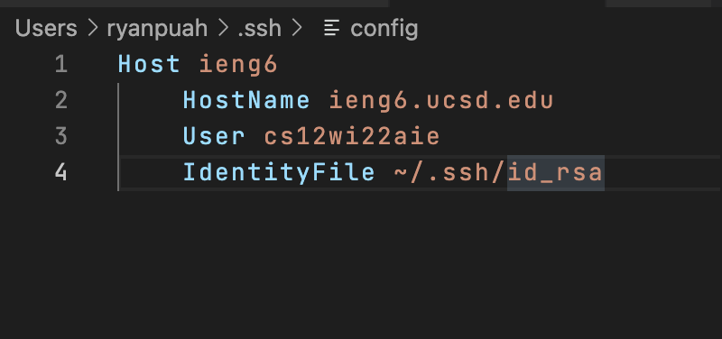
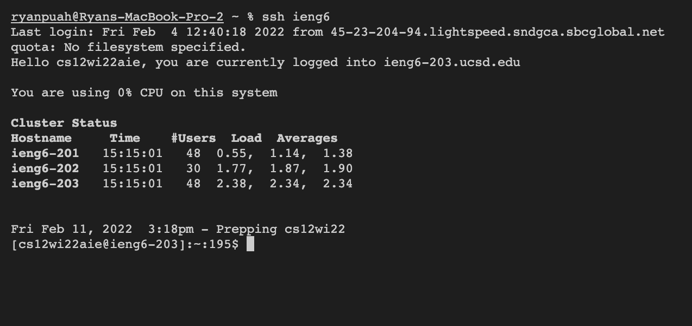
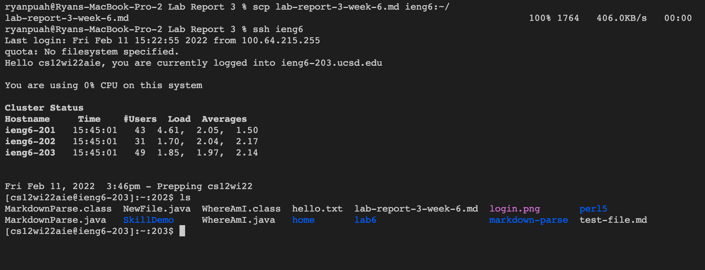

# Week 6 Lab Report 3

## Choice 1 - Streamlining `ssh` configuration

Normally, logging in to the ieng6 server from your device requires you to enter your whole username.
In some cases, this could be very long and you could forget the username. 

```
$ ssh cs15lwi22zzz@ieng6.ucsd.edu
```

By streamlining the ssh configuration, you'll be able to log in to the server just by typing this: 

```
$ ssh ieng6
```
Therefore saving you a lot of time.

### The Process: 

First, we would have to put in an entry in the configuration file of SSH.

- To do this: cd into the .ssh folder on your device by running this command: 
```
$ cd ~/.ssh/
```

- If the config file isn't in the .ssh file, create one using the command `touch`.

- Now that you're in the .ssh directory and the file `config` is created, open it up using the command `code` like this: 

```
$ code config
```

- This will open up the config file in VSCode so you can make edits to it. 

- After opening the file, add the Host, HostName, Username, and Identity file to it. It should look like this: 



- Now you should be able to log in just by typing `ssh ieng6` like this: 



## Copying a file to the account using ssh streamlining:

We're going to do an example where we're copying the file using the alias we chose. In my case, I used `ieng6` as the alias.

- We're going to copy this markdown file over to the remote server using the command `scp`.

- First, we have to `cd` into the directory where the file you want to copy is stored. 

- Then, we copy the file over to the remote server using the alias, which in my case is `ieng6`. 

- Then, we log into the server to check that the file is successfully copied. 

- An example should look like this:



And that's it!