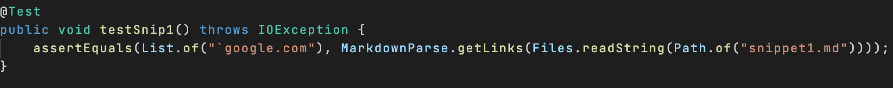
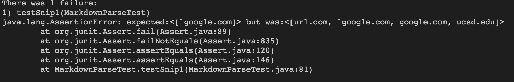
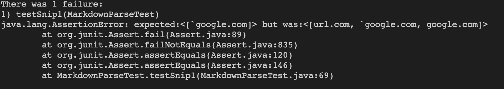
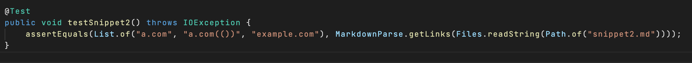
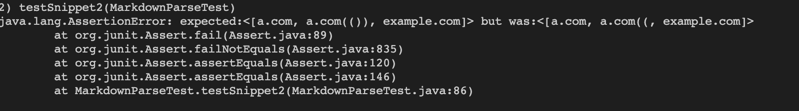
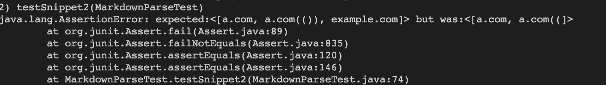
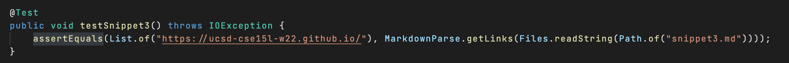
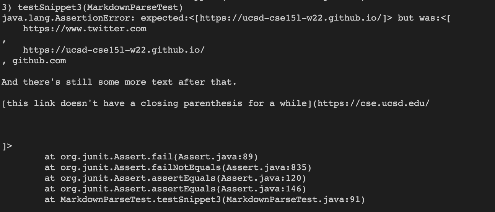
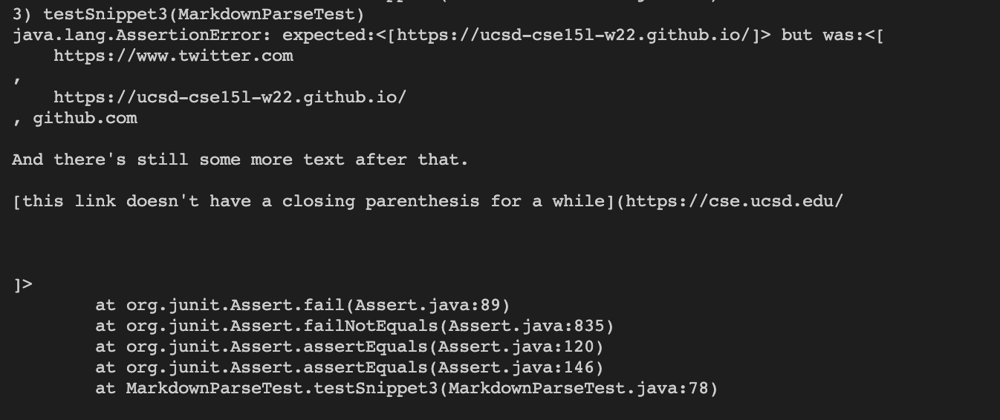

# Lab Report 4 

## Links to My Repo and Reviewed Repo

[My Repo](https://github.com/ryanp0126/markdown-parse)

[Reviewed Repo](https://github.com/artballesteros/markdown-parse)

## Snippet 1

What it should produce: ``[`google.com]``

JUnit Test: 

My Output: 

Reviewed Repo Output:

Code Change Question:

- I think that there is a simple code change that I can make which involves finding the first \` that occurs and checking if its between the open bracket and closing bracket and setting the current index to the \`. 

## Snippet 2

What it should produce: `` [a.com, a.com(()), example.com]``

JUnit Test:

My Output: 

Reviewed Repo Output:

Code Change Question:

- I think that there isn't a small code change that would work for this snippet. This would be a more involved change because you would have to write code that differentiates different amounts of brackets and use a stack to match the parentheses.

## Snippet 3 

What it should produce: `[https://ucsd-cse15l-w22.github.io/]`

JUnit Test:

My Output:

Reviewed Repo Output:

Code Change Question:

- I think that there is a small code change for this snippet that could work. One solution would be maybe to check for the newline character to see if its between the brackets or parentheses and if it is then you move to the next closing bracket or parenthesis.
