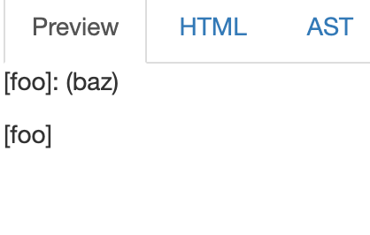
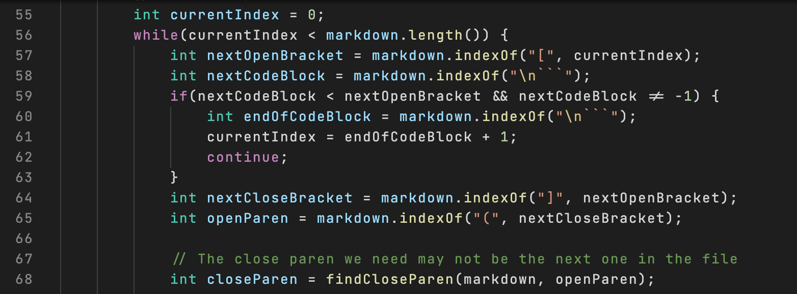
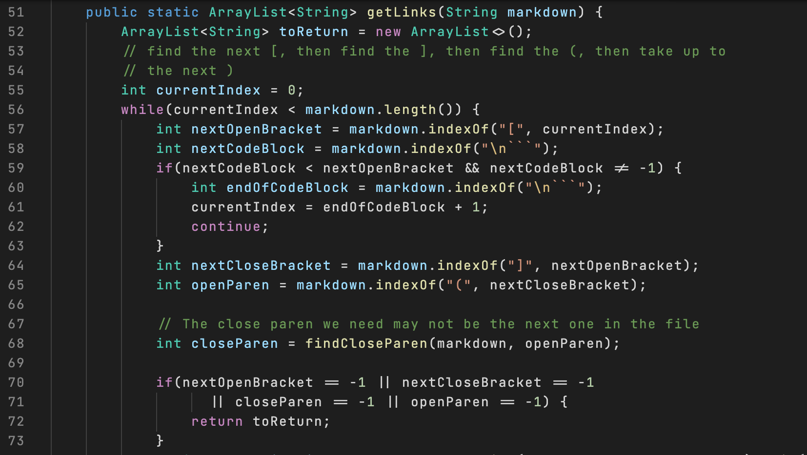

# Lab Report 5 Week 10

## How I found the tests with different results

What I did was use the command `vimdiff` to use vim to check the differences between both outputs. An example would be this: 
``` 
vimdiff markdownparselab/results.txt markdown-parse/results.txt
```
This allowed me to see the differences in both results.txt files.

## Test 1 

For this test, I chose the test `201.md`.

### Expected output 

 

- According to the commonmark demo site, there isn't a link in there, so the expected output should be `[]`.

### Actual outputs


- For my implementation, my output was `[]`, and for the implementation provided in week 9, the expected output was `[baz]`. Therefore my implementation is correct.

### Bug in incorrect implementation

#### Code that should be fixed:


- The bug in this program is that because the program does not check that the `]` is right next to the `(`, which is wrong because in markdown formatting, the `(` should be right next to the `]` to be counted as a link.

## Test 2

For this test, I chose test `577.md`.

### Expected output

- According to the commonmark demo site, the expected output is an image, which does not count as a link, so the expected output should be `[]`.

### Actual outputs


- For the implementation provided, the output was `[train.jpg]` while my output was `[]`. Therefore my implementation is correct in this case.

### Bug in incorrect implementation 

#### Code to be fixed:


- The bug that's causing this incorrect behavior is because in the provided implementation, it doesn't check if there is an exclamation mark before the `[`, causing the implementation to think that an image is a link.