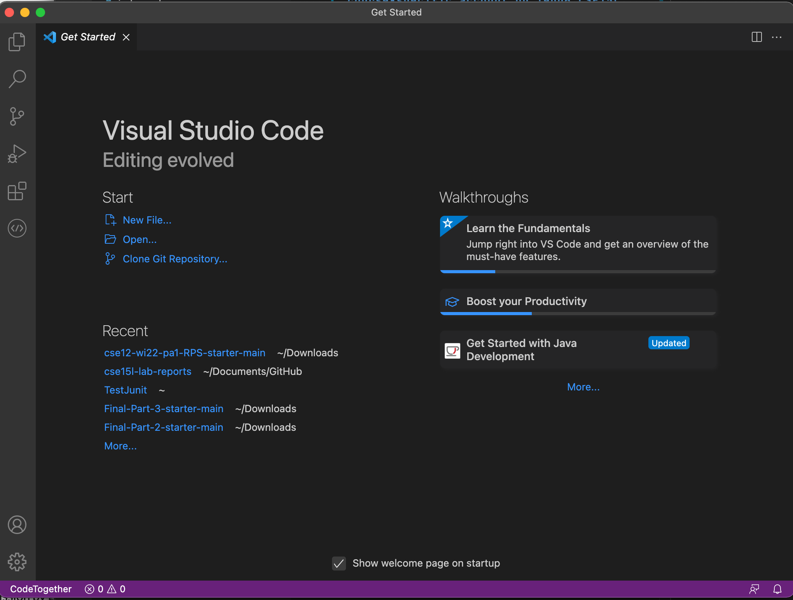
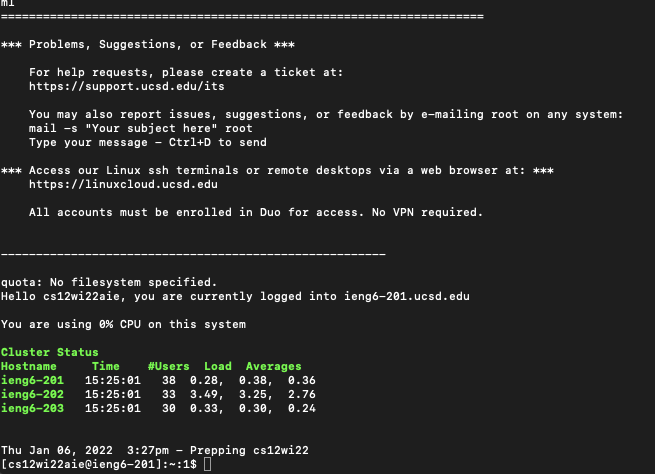
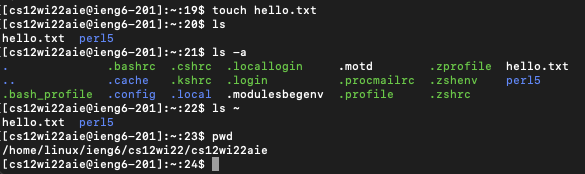
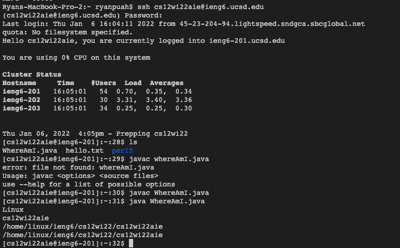
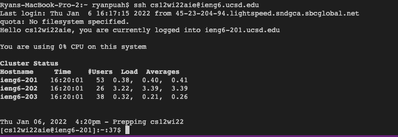
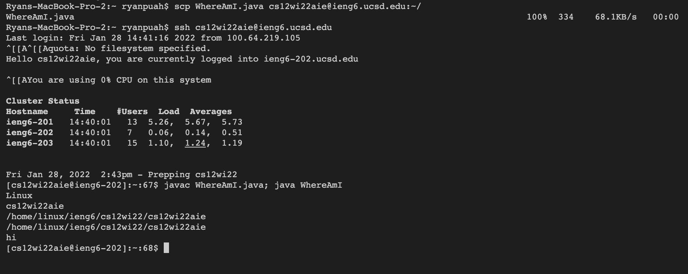

# How to Remotely Access a course-specific account on ieng6 CSE15L

## Installing VSCode 
- First, we have to go to the Visual Studio Code [website](https://code.visualstudio.com/). Then, download the right version according to your computer's OS. It should look like this if everything is successful.



## Remotely Connecting

- Next, look up your course-specific account for CSE15L on this [website](https://sdacs.ucsd.edu/~icc/index.php).
- We're now going to remotely connect to the remote computer using the terminal in VSCode.
- First, type in the ssh command followed by a space and your account id.
- Answer yes to any question that pops up and enter your password and you will be successfully connected. Your terminal should look something like this.



## Trying Some Commands

- Now that you're connected to the remote account, any commands you run on the terminal should run on the server.
- Try out some commands like cd, ls, pwd, mkdir to see what they do. You can always read more about a command using the command "man" followed by the command you want to know more about. Some examples are in the image below.


## Moving Files with SCP

- We'll begin to look more into the "scp" command, which is basically a command for copying files back and forth between the client and the server.
- One thing to note that is we will always run the command from the client.
- To use the command, type out the "scp" command followed by the name of the file you want to copy, followed by your account, like this: 
```
scp WhereAmI.java cs15lwi22zz@ieng6.ucsd.edu:~/
```
 - Enter your password when prompted and you should then be able to see the files copied to the server using the ls command.
 


## Setting an SSH key


 - So far we've had to enter our password when logging into the server, and it would be time-consuming if we had to do this repeatedly.
 - With ssh keys, we only have to enter our password once, and it creates a pair of public and private keys respectively and uses them in place of a password.
 - To run this, type the ```ssh-keygen``` command into the terminal on your client. Complete the prompts and it will create two new files on your system.
- Next, we're going to copy the public key to the .ssh directory of the user account on the server. An example would look like this: 

```
$ ssh cs15lwi22hi@ieng6.ucsd.edu
<Enter your password>
#on server
$ mkdir .ssh
$ <logout> 
#now on client
$ scp /Users/ryanpuah/.ssh/id_rsa.pub cs15lwi22hi@ieng6.ucsd.edu:~/.ssh/authorized_keys
```
- If successful, your terminal should look like this:


## Optimizing Remote Running

- Now we'll see how to optimize our commands to save us even more time and not repeat many commands.
- One way we can optimize this process is to use semicolons to combine two commands in one line, like:
```
$ ssh cs15lwi22hi@ieng6.ucsd.edu; ls; pwd
```
- Another way we can optimize it is to use quotes to run on the server then log out, such as: 
```
$ ssh cs15lwi22hi@ieng6.ucsd.edu "pwd"
```

- An example of making a local edit and then copying it to the remote server and running it using only under 10 keystrokes and only using the up arrow to recall commands that we ran: 



## That's it for everything, thanks!
