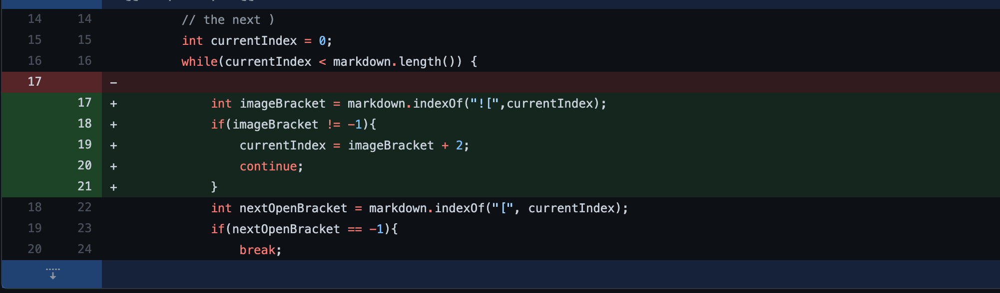

# Lab Report 2 Week 4

## Code Change 1

- Screenshot of the code change diff:

- [Link to the test file for the failure-inducing input](https://github.com/Darrengn/markdown-parse/blob/9d6bcd702b30aabcc2f46506bad8d20e608281e7/test-file6.md)

- Screenshot of the symptom of the failure-inducing input: 

- Relationship between the bug, the symptom, and the failure-inducing input: For test file 6, because the symptom was 

---

## Code Change 2 

- Screenshot of the code change diff:

- [Link to the test file for the failure-inducing input](https://github.com/Darrengn/markdown-parse/blob/9d6bcd702b30aabcc2f46506bad8d20e608281e7/test-file8.md)

- Screenshot of the symptom of the failure inducing input: